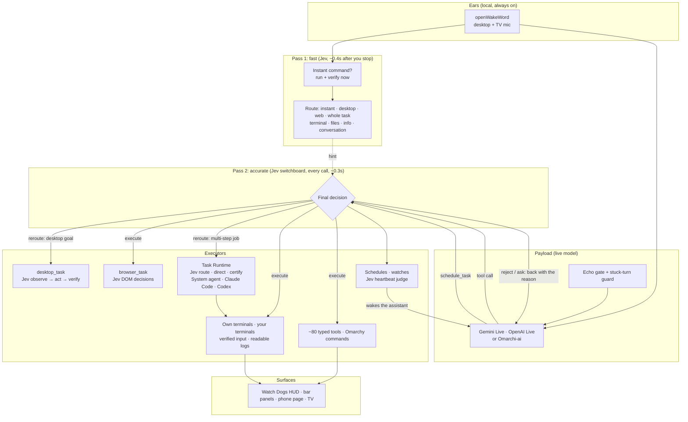
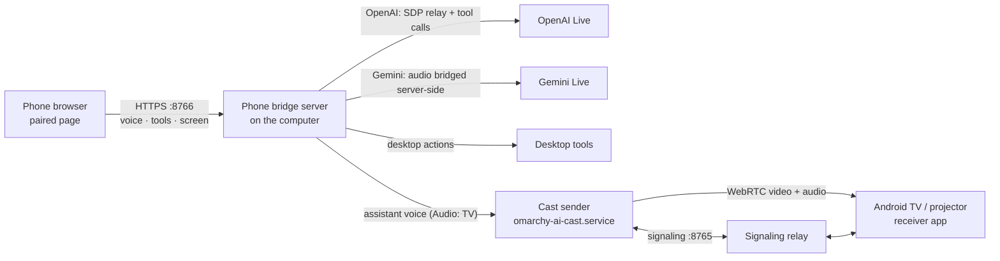

<div align="center">

```
                    ██████╗ ███╗   ███╗ █████╗  ██████╗██╗  ██╗██╗   ██╗
                   ██╔═══██╗████╗ ████║██╔══██╗██╔════╝██║  ██║╚██╗ ██╔╝
                   ██║   ██║██╔████╔██║███████║██║     ███████║ ╚████╔╝ 
                   ██║   ██║██║╚██╔╝██║██╔══██║██║     ██╔══██║  ╚██╔╝  
                   ╚██████╔╝██║ ╚═╝ ██║██║  ██║╚██████╗██║  ██║   ██║   
                    ╚═════╝ ╚═╝     ╚═╝╚═╝  ╚═╝ ╚═════╝╚═╝  ╚═╝   ╚═╝   

             A I  —  a n   a g e n t   t h a t   r u n s   y o u r   d e s k t o p

```

</div>
<div align="center">

[](LICENSE)
[](pyproject.toml)
[](https://omarchy.org)
[](STATUS.md)

</div>

---

**Omarchy AI** is a self-hosted, voice-driven **agentic assistant** for
[Omarchy](https://omarchy.org), the Arch-based Hyprland desktop. You say what
you want done. It plans the work, does it with real tools on your machine
(and on machines you're connected to), checks the result itself, and tells
you when it is verified. It is not a chatbot bolted onto a terminal.

- **Whole jobs, not single commands.** "Find what's using port 8080", "why
  does my Bluetooth keep disconnecting?", "fix this bug and test it". It
  works in the background, hands code to Claude Code or Codex when that
  fits, and certifies the result from evidence, not from its own claims.
- **Works alongside you.** Its commands run in its own terminals, so it
  never takes your keyboard, and you can keep talking while it works.
- **Keeps its promises.** "Tell me when the build finishes" sets up a real
  watch. When it fires, the assistant wakes up, tells you, and does the next
  step you asked for.
- **Asks before anything risky.** Installs, service restarts, deletes
  and root need your OK; root needs a click, not just a spoken yes.

<div align="center">

https://github.com/user-attachments/assets/49467e18-0e00-4db6-ba63-bbaf9927b218

</div>

---

## What it does

Say the wake word, then talk normally. Real requests from daily use:

**Whole jobs, done and verified**
- *"Find what is using port 8080"* / *"why does my Bluetooth keep
  disconnecting?"* / *"fix this bug and test it"* — the Task Runtime plans
  acceptance criteria, routes each step to the right worker (its Linux
  agent, Claude Code, Codex, a test or review agent), and reports **verified
  done** only when the harness's own evidence proves it.
- *"Install htop, and let me know when it's done"* — runs it in its own
  terminal, answers the sudo prompt from your keyring, and tells you when it
  finishes, even if you already said goodbye.
- *"Go through the instructions in this file and execute them"* — performs a
  scripted demo step by step, narrating each step while it runs.

**Your terminals and coding agents**
- *"In the focused terminal, tell Claude: …"* — relays your prompt to Claude
  Code, Codex or aider word for word, URLs, markdown and multi-line text
  included, then checks it arrived.
- *"SSH to the server with the same password as here"* — types your saved
  password into the prompt when you ask, without ever seeing it.
- *"Go to the Docker folder"* — finds `docker` when you said "Docker", and
  asks when several names fit.
- *"What did that build end up doing?"* — reads the terminal's real text,
  not a screenshot.

**Around the house**
- *"Cast this to the living room TV"* — mirrors screen and audio to a paired
  Android TV or projector, picks the right TV, and walks you through pairing
  a new one.
- From your phone: talk to Omarchy AI from a paired phone anywhere on your
  LAN or tailnet, and watch the PC's screen live on the phone or send it to
  the TV. The computer runs the server for both.
- *"Check my email for the invoice and save the attachment"* — reads Gmail
  (and 200+ other services) through MyApi instead of screen-scraping.

**Instant desktop control**
- *"Move this terminal to workspace 4"*, *"volume up"*, *"fullscreen the
  terminal, not the browser"* — Jev handles simple commands the moment you
  stop talking (about 0.4s), verifies them, and the reply is just "done".
- *"Switch to the catppuccin theme"*, *"remind me in 20 minutes to check the
  oven"* — straight through Omarchy's own ~230 commands and its real
  reminder popups.

---

## Gallery

**Phone session**: mirror the screen to your phone and operate the PC by talking to Omarchy.

<div align="center">

https://github.com/user-attachments/assets/7abed3fa-ed55-4835-b77a-4d0a1ab85f1f

</div>

**Phone bridge**: talk from a paired phone to Omarchy while mirroring the PC to Android TVs in your network.

<div align="center">

https://github.com/user-attachments/assets/6d20a7b9-3806-4248-be12-83bdddf63f66

</div>

**TV screen mirroring**: WebRTC cast to a paired Android TV / projector.

<div align="center">


</div>

---

## How it works

**Jev is the switchboard.** Every request goes through two passes: a fast
one the moment you stop talking, and an accurate one before anything runs.
The live model (Gemini) generates the payload, the concrete tool call, and
Jev makes the final routing decision on every call.



- **Pass 1, fast.** As soon as you stop talking, one Jev call reads your
  words. A clear simple command (switch workspace, move a window, volume,
  play/pause, fullscreen) runs at once and is verified, typically in about
  0.4s. The same call classifies the request into a route, which pass 2
  uses as a hint.
- **The live model generates the payload.** It talks, reasons, plans and
  writes the tool call: OpenAI Live (`gpt-live-1`, delegating to `gpt-5`),
  Google Gemini Live, or Omarchi-ai. It is the only part that generates
  words. Slow tools run in the background, so you can always keep talking.
- **Pass 2, accurate: Jev decides every call.** Before a call runs, Jev
  judges it against your latest words, the earlier turns, the pass-1 route
  and the calls already made. Code then applies a fixed policy: **execute**
  it; **send it back** with the reason when the target or values are wrong
  ("switch to 4" called as workspace 5), so the model corrects itself;
  **ask** you when the request is ambiguous; or **reroute** it, handing a
  native desktop goal to the Jev desktop loop and a multi-step job to the
  Task Runtime, with your own words as the goal. Reads start while Jev
  decides, so they cost nothing extra; state-changing calls wait about
  0.3s. If Jev is unreachable, calls run as before and the log says so. See
  [ADR-0003](docs/ADR-0003-jev-switchboard.md).
- **Jev answers typed questions, not prose.** [Typesafe AI's
  Jev](https://github.com/browser-use/jev-ultrafast) is a small evaluation
  model that returns probabilities over closed choices ("which route?",
  "does this call match the request?", "did the build finish?", "is this
  task done?"). The same model drives the desktop loop, the browser, the
  heartbeat and the Task Runtime.
- **Code owns time, commands and permissions.** When a job is due, what
  exactly runs, and what needs approval are decided by code, never by a
  model. Every shell command in the Task Runtime is risk-classified (LOW,
  NORMAL, ELEVATED, HIGH, BLOCKED) before it runs.
- **Claims are not evidence.** Keyboard input reports "sent, not verified";
  results are read back from terminal logs, window state or the page; the
  Task Runtime certifies only from commands, exit codes, diffs and tests the
  harness collected itself.

The conversation loop, tool registry, wake-word pipeline, Task Runtime,
casting stack and desktop UI are this project's own code, not Open
Interpreter or another agent framework.

### What changed since 0.5

- **Jev switchboard** ([ADR-0003](docs/ADR-0003-jev-switchboard.md)): a fast
  first pass classifies every request and runs instant commands, and an
  accurate second pass reviews every tool call the live model makes before
  it runs (execute, send back, ask, or reroute to the desktop loop or the
  Task Runtime).
- **Out-of-credit alerts**: red dollar signs on screen, a notification and a
  spoken warning when OpenAI, Gemini or Vercel AI Gateway run out.

### What changed in 0.5

- **Task Runtime** ([ADR-0002](docs/ADR-0002-task-runtime.md)): a persistent
  control plane (Jev) and execution plane (harness) for multi-step work, with
  executors for the System agent, Claude Code, Codex, test and review agents,
  permission levels, approvals, rollback checkpoints and an
  `omarchy-ai-task` CLI.
- **Always talkable**: slow tools (screen, casting, MyApi, command search,
  updates) run in the background instead of freezing the conversation.
- **Stuck-turn guard**: background speech used to keep Gemini's
  end-of-speech detection open for 40-108s. Reproduced against the live API
  (`scripts/probe_stuck_turn.py`); a short silence after your last words now
  gets a reply in about two seconds.
- **Terminals you can rely on**: logs survive daemon restarts and updates,
  windows are read by address (never a same-titled neighbour), watches pin
  the window even when ssh renames it, and typed text is not submitted twice.
- **Behaviour rules** learned from real sessions: quiet instant actions,
  approximate names, "which machine am I on", copy real config instead of
  inventing it, and no promise without a watch.

### Source layout

```
src/omarchy_ai/
  core/       daemon loop (listen → wake → converse), history and preference
              memory, Jev client, agenda/heartbeat and schedules, skills,
              updates, GitHub issue reporting
  voice/      wake word, OpenAI Live (aiortc), Gemini Live (echo gate,
              stuck-turn guard, missions), Omarchi-ai provider, the Jev
              switchboard (fast pass + per-call review), echo
              cancellation, TV microphone, HUD/status IPC
  runtime/    Task Runtime: task records, Jev control, permissions, shell,
              executors (system agent, direct tools, Claude Code, Codex)
  execution/  desktop actions and tool schemas, verified input, terminal
              logs, assistant terminals (workbench), co-pilot operator, Jev
              desktop and browser workers, files, vision, OS knowledge
  display/    mDNS discovery, device registry, casting session, signaling
  phone/      HTTPS phone bridge, Gemini phone bridge, audio to TV
  myapi/      MyApi client, usage log and dashboard
  knowledge/  packaged Omarchy expert guide, capability registry, Arch notes
  cli/        omarchy-ai-settings, omarchy-ai-task, omarchy-ai-dashboard
android-receiver/  Kotlin/Compose Android TV receiver app
quickshell/        Quickshell/QML plugins: HUD, window labels, settings, MyApi,
                   TV picker, quota alert
systemd/           omarchy-ai.service template
docs/              ADR-0001 (architecture), ADR-0002 (Task Runtime),
                   ADR-0003 (Jev switchboard),
                   JEV-DESKTOP, gemini-live, DEPENDENCIES, media
scripts/           install/build/publish, probes and the original spikes
```

- **Python**, managed with [`uv`](https://astral.sh/uv), on the system
  Python with `--system-site-packages` (for `python-gobject`/GStreamer).
- **Quickshell/QML** for every on-screen piece, as Omarchy user plugins (see
  [`quickshell/README.md`](quickshell/README.md)).
- **`aiortc`** for WebRTC, **`pywayland`** with `wlr-screencopy-unstable-v1`
  for screen capture (the portal ScreenCast path wedged on this hardware),
  **Kotlin + Jetpack Compose** with `stream-webrtc-android` for the TV app.

Every choice, including the dead ends, is in
[`docs/ADR-0001-architecture.md`](docs/ADR-0001-architecture.md), and the
full evidence trail of every bug is in [`STATUS.md`](STATUS.md).

---

## Features

### Agentic work

**Whole tasks (Task Runtime)**
- `start_task` hands a multi-step goal to a persistent runtime. A worker
  model writes the objective and acceptance criteria; Jev routes each step
  to an executor, then directs what happens next (continue, retry, change
  executor, spawn a subagent, run tests, request review, roll back, ask you,
  fail or certify).
- Executors: the **System agent** (runs and combines installed Linux tools,
  reads local `--help`/man pages for the installed version, launches apps,
  uses the desktop loop and vision), **direct desktop tools**, **test** and
  **review** agents, **Claude Code** and **Codex** (detected and used only
  when installed and logged in). Reviews go to an agent that did not write
  the change.
- Certification needs harness evidence: fresh command output after the last
  change, validated tests run after it, no failed test or review. Jev never
  sees a raw transcript, and executor claims are marked untrusted.
- Permission levels: LOW and NORMAL run; ELEVATED (installs, config,
  service restarts) waits for your OK; HIGH (root, credential access,
  deleting significant data) needs a click on the notification; BLOCKED
  (disk erase, `rm -rf ~`, reverse shells) is refused. Code changes get a git
  checkpoint so they can be rolled back.
- Tasks are saved after every change, survive restarts, and are announced
  when they finish, need approval or have a question. Follow them with
  `omarchy-ai-task`.

**Co-pilot mode**
- Installs, commands and long jobs run in its own tmux terminals
  (`terminal_task`), never in your windows or under your keyboard focus.
- While you're away its work is on your screen; while you're working it
  carries on in the background and hands it over when you stop for about 30
  seconds. "Show me" or "in the background" overrides this.
- Browser tasks run over DevTools, so they don't need focus either.

**Promises, schedules and the heartbeat**
- `schedule_task`: one-off or recurring reminders (times, intervals, cron),
  watches, scheduled desktop goals and background commands. They keep
  running between conversations.
- Watches follow one of your terminals, one of hers, a file or a command.
  Jev judges when your condition is true ("the build finished", "Claude is
  waiting for my approval") and points to the real output line as evidence.
- A promise to tell you when something finishes is backed by a real watch,
  with the next step you asked for ("then start the container"). When it
  fires the assistant wakes up and tells you; if you're away, it catches you
  up next time.

**Skills that improve over time**
- A procedure that worked is saved as a named skill (`SKILL.md` under
  `~/.config/omarchy-ai/skills/`) and rewritten when it turns out wrong. Jev
  picks the matching skill with a two-stage check and suggests nothing when
  none fits.

**Missions (scripted demos)**
- `run_mission`: give it a file of steps and it performs them in order,
  narrating each step while its action runs, keeping to the workspace the
  script names, verifying each step, and stopping to ask instead of
  improvising when something is missing.

### Terminals, machines and coding agents

- **Readable terminals**: terminals it opens are recorded with `script(1)`;
  every interactive Bash/Zsh terminal also writes a compact command, cwd and
  exit-status log, so it understands terminals you opened yourself.
  Terminals are read by window address, and logs stay readable across daemon
  restarts and updates.
- **Verified input**: `type_text`/`press_key` only go to a window whose
  focus was just verified; results say the input was sent, not that it
  worked, and the output is read back. Multi-line text is pasted as one
  block; a second Enter with nothing typed in between is not sent.
- **Other machines**: in an ssh session it works on that machine through
  its terminal, checks the prompt to know where it is, and exits before
  local work.
- **Passwords**: sudo prompts in its terminals are answered from the Sudo
  Access password in GNOME Keyring through a stdin-fed buffer (never in a
  command line). In your windows it types it into a sudo, or on request
  ssh/scp, prompt after checking the prompt is there. The model never sees
  the password.
- **Coding-agent relay**: prompts for Claude Code, Codex, aider and other
  terminal agents are delivered verbatim, submitted, and checked.
- **Approximate names**: "the Docker folder" finds `docker`; missing paths
  come back with near names; several matches mean it asks.
- **Copy, don't invent**: to mirror a setup it copies the real text and
  changes only what must change; screenshots are never used to write files.
- Arch-aware shell guidance: `pacman`/`yay`, never `apt`/`dnf`/`brew`.

### Web

**Jev browser**
- Web tasks run in one dedicated Chromium tab driven by
  [`browser-use/jev-ultrafast`](https://github.com/browser-use/jev-ultrafast)
  with screenshots off; each DOM decision is a `typesafe-ai/jev` call.
  Success is reported only after an independent Jev check confirms the page
  shows the goal done; otherwise it says where it stopped.
- The live model breaks requests into literal steps with plain search terms
  ("eggs", not "a pack of eggs") and asks when something is missing, like
  which store.
- New tabs are folded back into the one tab, clicks land on the element
  itself, a dropped browser connection heals, and a control clicked over and
  over is capped. Runs stop at 20 actions or 45 seconds.

### Desktop control

About 80 typed tools plus Omarchy's full command set:
- Volume/mute, mic mute, brightness, night light, Bluetooth, battery, media
  playback, screenshots, screen lock.
- Workspaces, window listing/focus/fullscreen/close, and
  `move_window_to_workspace` in one verified step. Targeting is
  workspace-aware ("the terminal" is the one on your current workspace), and
  terminals can be named by what runs in them ("the Claude terminal").
- `desktop_task`: a Jev observe → act → verify loop for native goals
  (workspaces, focus, volume, brightness, themes, bar panels), with
  `search_os_knowledge` over the packaged Omarchy guide and Arch notes. See
  [research and measured limits](docs/JEV-DESKTOP.md).
- `list_commands`/`execute_command` reach all ~230 Omarchy keybinding
  commands; Jev ranks them by meaning in any language, with fuzzy matching
  as the fallback.
- `run_omarchy_command` runs a scoped allowlist of the `omarchy` CLI; package
  installs, updates, reboots and destructive commands are refused.
- Reminders through Omarchy's own popups (`set_reminder` and friends; "at
  3pm" is converted into minutes).
- Launchers for terminal, browser, files and editor.
- Local files: `list_files`, `read_file`, `write_file`, and exact-replacement
  edits in your home directory and `/tmp` (add more with `file_access_roots`
  in `~/.config/omarchy-ai/config.yaml`). New files by default; overwriting
  only when you ask.
- Floating name-label badges over candidate windows when it isn't sure
  which one you mean.
- `describe_screen`: a screenshot and a vision call, only as a fallback;
  on a terminal it is pointed to the terminal's text instead.

### Voice and conversation

- Local wake word (`openWakeWord`), listening continuously and connecting to
  a provider only when triggered: no connection, and no per-second billing,
  outside a conversation. Load any number of custom models from
  `~/.config/omarchy-ai/wake_models/*.onnx`; "omachy", "omri" and "roni" ship.
- Three providers: **OpenAI Live** (`gpt-live-1` over WebRTC), **Gemini
  Live** (full duplex, desktop and phone), and **Omarchi-ai** (turn-based:
  Jev decisions, Gateway transcription and TTS, a compact model for
  wording).
- **Jev switchboard**: when you stop talking, Jev reads the utterance, runs
  simple commands at once and classifies the rest; then it reviews every tool
  call the live model makes before it runs, sending wrong calls back,
  asking when the request is ambiguous, and rerouting desktop goals and
  multi-step jobs to the right executor. The fast pass and the live model
  never repeat or contradict each other's action.
- Gemini on the desktop uses private PipeWire echo cancellation without
  touching other apps' audio devices. Its own voice leaking back can't cut
  it off (you still can, by speaking up), and a stuck-turn guard answers
  within about two seconds even with a TV on.
- Quick actions are quiet: done, then "done". No "switching now" and "I
  switched" around a 0.1-second action.
- Ends on "bye"/"that's all" in any language by watching its own spoken
  farewell.
- Memory: recent conversations are folded into the next session, and
  standing preferences ("always type terminal commands in English") are
  saved with `remember_preference`.

### Phone, mirroring and TV: the server on your computer

Omarchy AI runs its own small servers on the computer, so a phone or a TV
never needs a cloud relay or your API keys.



**Phone bridge server** (HTTPS, port 8766, LAN and Tailscale)
- **Talking through the phone.** The phone opens a page served by the
  computer. With OpenAI, the server relays the phone's WebRTC offer to the
  Live API with the key it holds, and runs the model's tool calls on the
  desktop; the phone talks to OpenAI directly for audio. With Gemini, the
  server bridges the phone's WebRTC audio to Gemini Live itself (up to two
  phones at once), so no key or tool authority ever reaches the phone.
- **Mirroring the screen to the phone.** Start **Mirror** on the page and the
  server streams live screenshots of the desktop over the same authenticated
  HTTPS connection, edge to edge, while you keep talking. Stop it from the
  page.
- **Sending the voice to the TV.** While the desktop is cast to a TV,
  **Audio: phone → TV** sends the assistant's speech into the cast sender's
  audio track over a private local socket; **Audio: TV** returns it to the
  phone. It falls back to the phone when mirroring ends or an upload fails.
- **Pairing is the access gate.** A QR code from the settings panel carries
  a single-use 5-minute token; the phone gets a signed session cookie, and
  every page, stream and API call without it gets a 403. Pairings can be
  revoked all at once.
- **Certificates.** Self-signed, so mobile browsers allow the microphone.
  With Tailscale connected, new pairing QRs use the tailnet address and the
  certificate covers the LAN IP, tailnet IP and DNS name.
- The page is a full-screen state field readable across the room (red: it
  can't hear you), with **Text** mode for typing instead of talking.

**TV / projector mirroring**
- `omarchy-ai-cast.service` captures the screen directly with
  `wlr-screencopy`, encodes `openh264enc` video and Opus system audio, and
  sends them over WebRTC to the TV. A signaling relay
  (`omarchy-ai-signaling.service`, WebSocket port 8765) introduces the two
  and buffers the offer until the TV app is ready. Casting runs
  independently of conversations and assistant restarts, with bounded
  retries (`journalctl --user -u omarchy-ai-cast.service -u
  omarchy-ai-signaling.service -f`).
- mDNS discovery of Android TVs (`_androidtvremote2._tcp`), a live
  device-picker overlay you can answer by voice or click, and guided ADB
  pairing for a TV never set up before.
- A Kotlin/Compose receiver app (`android-receiver/`) that auto-connects and
  shows the Omarchy wallpaper while idle.
- A USB or headset microphone on the TV can wake the assistant and carry the
  conversation; desktop and TV wake detection run independently.

### Surfaces and integrations

**"Watch Dogs" HUD overlay**
- A Quickshell overlay with a live feed of tool calls, a reactive
  ASCII/braille visualizer, or both. One colour per state (connecting,
  listening, thinking, speaking); successful tools tint green, failures red.
  Driven by the daemon's lifecycle, not by the model.

**Out-of-credit alerts**
- When OpenAI, Gemini or Vercel AI Gateway credits, quota or token limits
  run out, you get told instead of silence: red dollar signs pop up over
  every screen with the provider's name, a critical notification links to
  the billing page, and a voice says what happened. If the conversation runs
  on a provider that still works, the assistant says it in your language;
  when the voice provider itself is out, a pre-recorded warning in the
  assistant's own voice plays locally (English or Hebrew, from your recent
  conversations).
- Background errors alert at most once per provider every 10 minutes; a
  wake word that fails because of it is always answered. Outages and plain
  rate limits don't trigger it. Try it with
  `.venv/bin/omarchy-ai-settings test-quota-alert openai` (or `gemini`,
  `vercel`).

**Settings panel**
- A bar panel for provider and keys (OpenAI, Gemini, Jev / Vercel AI
  Gateway), wake word and sensitivity, voice, HUD mode, Sudo Access, phone
  pairing and MyApi. It refuses to restart the assistant mid-conversation.
  The bar icon carries a live-status dot.

**Connect other services (MyApi)**
- One code from your [MyApi](https://www.myapiai.com) dashboard connects
  Gmail, Calendar, Drive, Notion, Slack and 200+ services, with no OAuth
  redirect and no token shown. It prefers a real API call over a browser and
  a screenshot, read-only for now. Gmail attachments have a dedicated
  search-and-download flow into `~/Downloads/Omarchy_AI/`.
- A MyApi bar panel and `omarchy-ai-dashboard` show live per-service usage.
  Requires a MyApi Pro/Heavy/Enterprise plan.

**Updates, release notes and issues**
- `check_assistant_updates` / `update_assistant` install checksum-verified
  GitHub Release bundles in a separate service, keeping the previous install
  to roll back to. It mentions a new version on wake, offers to go through
  the highlights (`get_release_notes` reads them from `CHANGELOG.md`), and
  only installs when you ask.
- A failed update, or *"file an issue about this"*, can open a GitHub issue
  when a token is configured.

---

## Installation

### Fast install (copy and paste)

On an x86-64 Omarchy desktop, paste this whole block into a terminal.
Internet access is required; missing system packages ask for sudo approval.
Existing API keys and settings are preserved.

```bash
(
set -euo pipefail
mkdir -p "$HOME/.local/share/omachy-ai-releases"
cd "$HOME/.local/share/omachy-ai-releases"
# Newest stable vX.Y.Z GitHub Release (skips demo-media and non-version tags).
version="$(curl -fsSL "https://api.github.com/repos/omribenami/Omarchy-AI/releases?per_page=100" \
  | grep -o '"tag_name": *"v[0-9]*\.[0-9]*\.[0-9]*"' | grep -o '[0-9]*\.[0-9]*\.[0-9]*' \
  | sort -V | tail -1)"
[ -n "$version" ] || { echo "Could not find an Omarchy AI release" >&2; exit 1; }
echo "Installing Omarchy AI $version"
package="omarchy-ai-${version}-linux-x86_64.tar.gz"
base="https://github.com/omribenami/Omarchy-AI/releases/download/v${version}"
curl -fL "$base/$package" -o "$package"
curl -fL "$base/$package.sha256" -o "$package.sha256"
sha256sum -c "$package.sha256"
tar -xzf "$package"
cd "omarchy-ai-${version}-linux-x86_64"
bash install.sh
systemctl --user enable --now omarchy-ai.service
systemctl --user restart omarchy-ai.service
)
```

The block finds the newest stable `vX.Y.Z` release itself (the non-package
`demo-media` release is skipped), so it never needs editing. To install a
specific version, replace the `version=...` lines with, for example,
`version=0.5.0`. The `.sha256` file is checked before the archive is unpacked.

Keep the extracted directory: the service runs from it. The installer
installs missing native packages, creates the locked Python environment,
installs the desktop plugins, copies the wake-word models, creates the user
config and installs the systemd service. It never guesses or overwrites your
API key.

Then open the **Omarchy AI** settings panel on the right side of the bar,
choose **OpenAI**, **Gemini** or **Gateway voice**, add that provider's key,
and press **Apply saved changes**. For Jev desktop, browser and Task Runtime
decisions, also save a **Jev / Vercel AI Gateway key** (this integration uses
the Gateway key; it does not take a separate TypeSafe token). Keys are saved
owner-only in `~/.config/omarchy-ai/key`, `gemini-key` and
`vercel-ai-gateway-key`. To let it answer sudo prompts, enable **Sudo
Access**; the password is kept in GNOME Keyring. New installs default to the
`omachy` wake word and the ASCII visualizer. Refresh paired phone pages after
upgrading.

For an existing source checkout: `git pull --ff-only`, `bash install.sh`,
then restart `omarchy-ai.service`.

### Release package

Download `omarchy-ai-<version>-linux-x86_64.tar.gz` and its `.sha256` from the
GitHub Release `v<version>`, then:

```bash
sha256sum -c omarchy-ai-<version>-linux-x86_64.tar.gz.sha256
tar -xzf omarchy-ai-<version>-linux-x86_64.tar.gz
cd omarchy-ai-<version>-linux-x86_64
./install.sh
```

The bundle contains the app wheel and source, the dependency lockfile,
plugins, wake models, a pinned Jev Ultrafast wheel (the installer checks its
`Agent` imports) and the Android receiver at `android/omarchy-ai-receiver.apk`.
It does not change firewall rules, and prints the `adb install -r` command
for the receiver. Python dependencies and native packages are downloaded
during installation, so it is not an offline installer.

### From source

**1. Native dependencies** (see [`docs/DEPENDENCIES.md`](docs/DEPENDENCIES.md)):

```bash
sudo pacman -S --needed android-tools gst-plugins-bad gst-plugins-good \
  gradle qrencode python-gobject pipewire-audio pipewire-pulse libpulse uv
yay -S android-sdk-cmdline-tools-latest
```

GStreamer, PipeWire, `xdg-desktop-portal-hyprland`, `avahi-daemon` and
`python-gobject` ship with Omarchy; `install.sh` installs missing runtime
packages. The Android SDK and Gradle are only needed to rebuild the receiver.

**2. Clone and install:**

```bash
git clone https://github.com/omribenami/Omarchy-AI.git ~/Git/omarchy-ai
cd ~/Git/omarchy-ai
bash install.sh
```

`setup.sh` creates a `uv` venv **with `--system-site-packages`** (a plain
`uv venv` can't see the system GStreamer bindings), runs `uv sync`, writes a
starter `~/.config/omarchy-ai/config.yaml` and installs the systemd user unit.

**3. API key.** Use the settings panel, which writes the key `0600` and never
echoes it back. Without the panel, pipe it on stdin (never as an argument,
since argv is readable through `/proc/<pid>/cmdline`):

```bash
echo -n "sk-..." | .venv/bin/omarchy-ai-settings set-api-key
```

**4. Wake word:** "omachy" (default), "omri" and "roni" ship in
[`wake_models/`](wake_models/) and are installed to
`~/.config/omarchy-ai/wake_models/`. Add or remove `.onnx` models there.

**5. Enable and start the service:**

```bash
systemctl --user enable --now omarchy-ai
journalctl --user -u omarchy-ai -f
```

**6. Firewall**, if casting or the phone bridge should be reachable on your
LAN (adjust the subnet):

```bash
sudo ufw allow from 192.168.1.0/24 to any port 8765 proto tcp  # casting signaling
sudo ufw allow from 192.168.1.0/24 to any port 8766 proto tcp  # phone bridge
```

For the phone bridge over Tailscale, both devices must be on the tailnet and
its rules must allow TCP 8766. Restart the service if Tailscale connects after
it started, to refresh the certificate, and pair again after a hostname or IP
change.

**7. Android receiver** (casting only): the release package includes the APK.
From source it is built on the first `install_receiver_on_tv` call, or with
`cd android-receiver && mise exec -- ./gradlew :app:assembleDebug` (run
`mise install` there first for the pinned JDK/SDK).

**8. MyApi** (optional): flip **Enable** in the settings panel's "Connect
services" section, open the MyApi bar icon, generate a one-time code on
myapiai.com, paste it and click **Connect**. Or:

```bash
echo -n "MYAPI-XXXXXXXX-XXXXXXXX" | .venv/bin/omarchy-ai-settings connect-myapi
```

---

## Updates

Omarchy AI checks GitHub Releases at startup and every 15 minutes. A release
counts when its tag is a stable `vX.Y.Z` and it has both
`omarchy-ai-X.Y.Z-linux-x86_64.tar.gz` and the matching `.sha256`; drafts,
prereleases and `demo-media` are ignored. On wake it refreshes an expired
check (2-second limit) and mentions a newer version in its first reply.
Offline checks never block a conversation.

Say **"Check for updates"**, **"Update yourself"** or **"What's the update
status?"**. Only an explicit request installs. The updater verifies the
checksum, unpacks the bundle and prepares a new environment before stopping
the assistant, keeping your keys, settings, history and source checkout. It
runs in `omarchy-ai-update.service`, keeps the previous install, and restores
it if setup or startup fails. Progress is in
`~/.local/state/omarchy-ai/updates/install.json`, output in
`journalctl --user -u omarchy-ai-update.service`. Missing system packages are
reported rather than prompting for sudo from a background session. Android
receiver updates are separate.

Historical bundles under [`dist/`](dist/) stay in the version list; the
highest version wins. Integrity is the SHA-256 file shipped as a Release asset
(not a separate publisher signature).

**Issue reporting.** With a GitHub token configured, a failed self-update
files an issue with the details, and *"file an issue about this"* works for
any problem (`report_issue`). Without a token it says honestly that nothing
was filed. Opt-in, per machine, stored `0600` at
`~/.config/omarchy-ai/github-issue-token`:

```bash
GITHUB_ISSUE_TOKEN=<a fine-grained PAT, Issues: write only on omribenami/Omarchy-AI> \
  .venv/bin/python -m omarchy_ai.cli.settings set-github-issue-token
```

`forget-github-issue-token` removes it.

---

## Maintainers: build and publish a release

Build from a clean, committed checkout; the tarball is a Release asset, not a
git commit.

1. Bump `version` in `pyproject.toml`, run `uv lock`, and rename
   `## [Unreleased]` in `CHANGELOG.md` to `## [<version>] - <date>` (its
   `### Highlights` are what the assistant reads aloud as "what's new"). Commit and push.
2. Build:

   ```bash
   ./scripts/build-install-package.sh
   ```

   This refuses a dirty checkout, a stale `uv.lock` or a version without
   CHANGELOG highlights, then writes `dist/omarchy-ai-<version>-linux-x86_64.tar.gz`
   and its `.sha256`: the Python wheel and sdist, a fresh receiver APK
   (`--skip-android` omits it) and all tracked runtime files. `dist/` is
   gitignored; don't `git add` new tarballs.
3. Publish tag `v<version>` with both files. HEAD must be `origin/main`.
   Dry-run prints the `gh` command and REST steps; `--publish` uploads.

   ```bash
   .venv/bin/python scripts/publish-github-release.py          # inspect
   .venv/bin/python scripts/publish-github-release.py --publish
   ```

The publisher uses `gh` when available, otherwise `GH_TOKEN`/`GITHUB_TOKEN`
(contents: write) against the REST API; re-running replaces the two assets.
Download counts are `assets[].download_count` on the release, or:

```bash
gh release view v<version> --repo omribenami/Omarchy-AI --json assets \
  --jq '.assets[] | {name, downloadCount}'
```

Without a local GitHub credential, a connected MyApi identity can publish the
**source commit** (it refuses a dirty checkout, a moved `main`, and the
tarball bytes); run the Release publisher afterwards on a machine with `gh`:

```bash
.venv/bin/python scripts/publish-via-myapi.py          # inspect the change set
.venv/bin/python scripts/publish-via-myapi.py --publish
```

---

## Known gaps

Documented honestly rather than papered over:

- **Permissions are enforced in the Task Runtime, not yet for every live
  tool.** Task Runtime commands go through the risk classifier and
  approvals. The live model's own tools are still a hand-curated list of
  read-only and reversible actions (plus Sudo Access, which you enable
  explicitly), not a separate enforcement layer.
- **Behaviour rules are prompts.** "Which machine", "copy, don't invent" and
  "no promise without a watch" were verified against the live model with
  scripted terminals, and still depend on the model following them; it can
  still call a job done before reading the final check.
- **The switchboard covers Gemini (desktop and phone).** OpenAI Live and
  Omarchi-ai keep their own dispatch, and mission sub-steps are judged as
  one `run_mission` call. Each state-changing call pays about 0.3s for the
  review; a focus → type → Enter chain pays it three times.
- **The phone bridge** has no per-phone action history and doesn't drive the
  bar's status dot or the HUD. The stuck-turn guard is desktop-only.
- **Casting audio** is not yet measured as rigorously as video (steady 15fps,
  zero drops in testing).
- **MyApi is read-only**: sending mail or creating events isn't wired up.
  Disconnecting in the panel only stops this machine; remove the device in
  your MyApi dashboard to fully revoke access.
- The settings panel's path to the settings CLI is hardcoded to the original
  checkout location; see [`quickshell/README.md`](quickshell/README.md) if you
  cloned elsewhere. The daemon runs fine without the plugins (IPC calls just
  log a warning).

See [`STATUS.md`](STATUS.md) for the full debugging history and
[`docs/`](docs/) for the architecture decisions.

## License

MIT — see [LICENSE](LICENSE).
