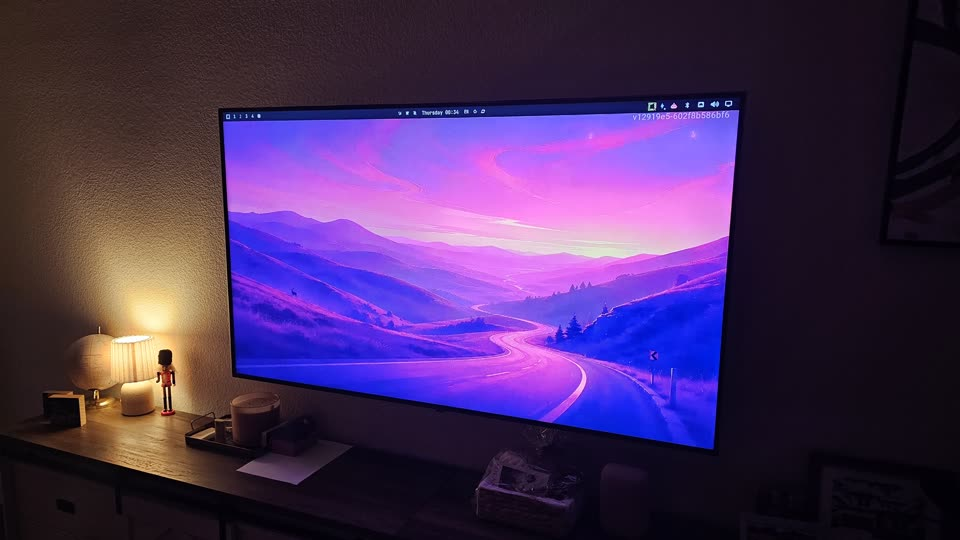
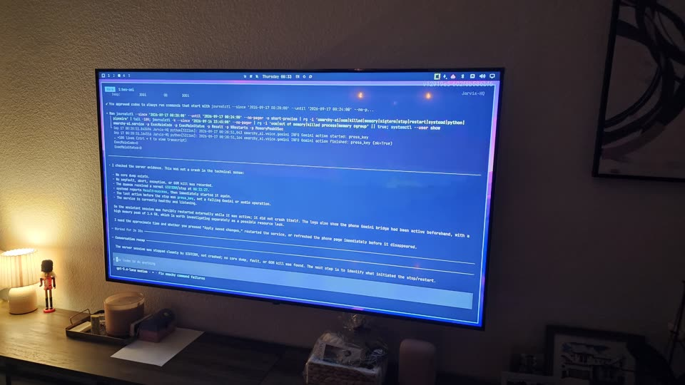

<div align="center">

```
 █████╗ ███╗   ███╗ █████╗  ███╗ █████████║██╔��██╗██╔�����██║  ██║╚██╗ ██╔�
██║   ██║██╔████╔██║██║     ███████║ ╚███╔� 
██║   ██║██║╚██╔�██║██╔��██║██║     ██╔��██║  ╚██╔�  
╚██████╔�██║ ╚�� ██║██║  ██║╚██████╗██║  ██║   ██║   
 ╚������ ╚��     ╚��╚��  ╚�� ╚������╚��  ╚��   ╚��   

                    A I  —  v o i c e   f o r   t h e   d e s k t o p

```

</div>
<div align="center">

[](LICENSE)
[](pyproject.toml)
[](https://omarchy.org)
[](STATUS.md)

</div>

---

## Demo

A condensed walkthrough of the assistant in action:

<div align="center">

https://github.com/user-attachments/assets/fac7e740-cdd3-414f-be3e-524dd60bdca7

</div>

---

**Omarchy AI** is an independent, self-hosted voice assistant for
[Omarchy](https://omarchy.org) — the Arch-based Hyprland desktop. Say a wake
word, talk in plain language, and it *does things* on your machine: windows,
volume, themes, reminders, casting to a TV, phone bridge — not a chatbot
bolted onto a terminal.

Built directly on OpenAI Live or Gemini Live, with a typed tool-calling layer
that turns speech into real Hyprland / PipeWire / desktop actions. The
conversation loop, tool registry, wake-word pipeline, casting subsystem, and
desktop UI are all this project's own code — not Open Interpreter or
another agent framework.

> **Honest status.** The daemon runs as a systemd service today, has driven a
> real desktop across dozens of live voice sessions, and casts to a real
> Android TV over WebRTC. It was built in one long, evidence-driven session —
> see [`STATUS.md`](STATUS.md). A release bundle ships the Python
> distributions, locked source, desktop plugins, wake models, service unit,
> and Android receiver APK.

---

## Feature gallery

**Phone session** — mirror the screen to your phone and operate the PC by talking to Omarchy.

<div align="center">

https://github.com/user-attachments/assets/6d20a7b9-3806-4248-be12-83bdddf63f66

</div>

**Phone bridge** — talk from a paired phone to Omarchy while mirroring the PC to Android TVs in your network.

<div align="center">

https://github.com/user-attachments/assets/7abed3fa-ed55-4835-b77a-4d0a1ab85f1f

</div>

**TV screen mirroring** — WebRTC cast to a paired Android TV / projector.

<div align="center">


</div>


---

## What it does

Say the wake word, then talk normally. A few real examples of what it's
been used for, live:

- *"Turn the volume up"* / *"set brightness to 40%"* — done immediately.
- *"Fullscreen the terminal, not the browser"* — it lists open windows,
  figures out which one you mean (asking you, with a floating label over
  the actual window, if it's still ambiguous), focuses it, then acts.
- *"Cast this to the living room TV"* — mirrors your screen and audio to a
  paired Android TV or projector over WebRTC, picks the right TV if more
  than one is on the network, and can walk you through pairing a brand new one it's never seen before.
- *"Remind me in 20 minutes to check the oven"* —  a real desktop
notification via Omarchy's own reminder mechanism, not a fake promise.
- *"Switch to the catpuccino theme" — routed straight through Omarchy's
  own 228 built-in commands.
- *"What did that build in the terminal end up doing?"* — it reads the real
  text a terminal it opened has printed, instead of taking (and paying for)
  a vision-model screenshot.

## Features
**Voice & wake word**
- Fully local wake-word detection (`openWakeWord`), listening continuously
  and opening a conversation with the selected provider only when triggered — no
  connection (and no per-second billing) outside an active conversation.
- Any number of custom wake-word models can be loaded at once
  (`~/.config/omarchy-ai/wake_models/*.onnx`) — whichever one fires wakes
  it, configurable threshold/trigger-frame sensitivity.
- Two-way, low-latency realtime voice via `gpt-live-1  over WebRTC
  (`aiotrc`), delegated to `gpt-5` for reasoning/tool-calling.
- Selectable Gemini Live on desktop and phone, with non-blocking desktop
  actions. Desktop Gemini uses private PipeWire echo cancellation and noise
  suppression without changing other applications' default audio devices.