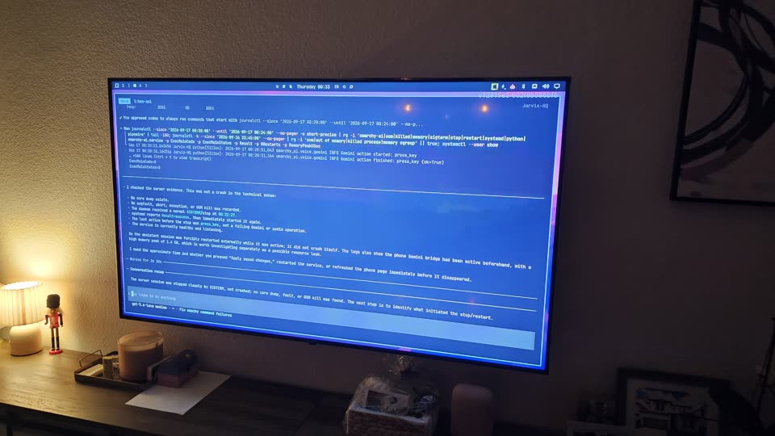
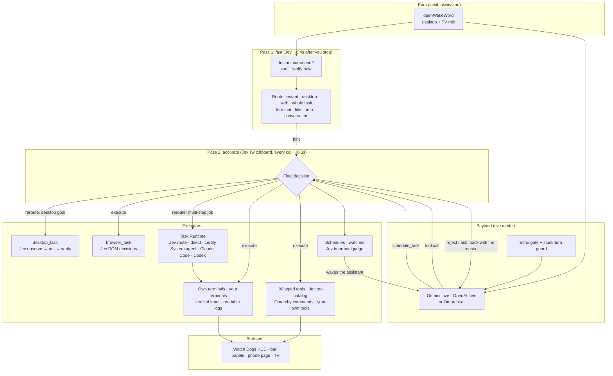
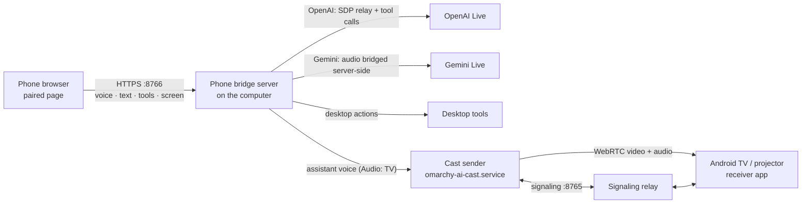

<div align="center">

```
                    ██████╗ ███╗   ███╗ █████╗  ██████╗██╗  ██╗██╗   ██╗
                   ██╔═══██╗████╗ ████║██╔══██╗██╔════╝██║  ██║╚██╗ ██╔╝
                   ██║   ██║██╔████╔██║███████║██║     ███████║ ╚████╔╝ 
                   ██║   ██║██║╚██╔╝██║██╔══██║██║     ██╔══██║  ╚██╔╝  
                   ╚██████╔╝██║ ╚═╝ ██║██║  ██║╚██████╗██║  ██║   ██║   
                    ╚═════╝ ╚═╝     ╚═╝╚═╝  ╚═╝ ╚═════╝╚═╝  ╚═╝   ╚═╝   

             A I  —  a n   a g e n t   t h a t   r u n s   y o u r   d e s k t o p

```

</div>
<div align="center">

[](LICENSE)
[](pyproject.toml)
[](https://omarchy.org)
[](STATUS.md)

</div>

---

**Omarchy AI** is a self-hosted, voice-driven **agentic assistant** for
[Omarchy](https://omarchy.org), the Arch-based Hyprland desktop. You say what
you want done, from the desk, from your phone or from the TV across the
room. It plans the work, does it with real tools on your machine (and on
machines you're connected to), checks the result itself, and tells you when
it is verified. It is not a chatbot bolted onto a terminal.

- **It operates the whole machine.** Desktop, windows and workspaces, its
  own terminals and yours, a real browser, files, system administration,
  and code through Claude Code or Codex, with about 90 typed tools and all
  of Omarchy's ~230 commands behind one voice.
- **Whole jobs, not single commands.** "Find what's using port 8080", "why
  does my Bluetooth keep disconnecting?", "fix this bug and test it". A
  background Task Runtime plans the job, routes each step to the right
  worker, and certifies the result from evidence, not from its own claims.
- **Doesn't give up quietly.** When something keeps failing it hands the job
  to a background worker that digs deeper, and tells you it did.
- **Works alongside you.** Its commands run in its own terminals, so it
  never takes your keyboard, and you can keep talking while it works.
- **Keeps its promises.** "Tell me when the build finishes" sets up a real
  watch. When it fires, the assistant wakes up, tells you, and does the next
  step you asked for.
- **Asks before anything risky, and tells you it's waiting.** Installs,
  pushes, service restarts, deletes and root need your OK. A waiting
  approval is announced out loud and floats as an envelope on screen with
  Approve / Deny; root needs a click, not just a spoken yes.

<div align="center">

https://github.com/user-attachments/assets/ea736181-9cf3-423a-b7d5-91a895fe6589

</div>

---

## What it does

Say the wake word ("omachy"), press **Super + `**, or type with
**Super + Ctrl + `**, then talk normally. Real requests from daily use:

**Diagnose and fix, verified**
- *"The nginx service keeps failing to start. Find out why from the journal
  and fix it."* / *"Find what is holding port 8080."* / *"Bluetooth
  headphones keep disconnecting; investigate."* — the Task Runtime plans
  acceptance criteria, investigates read-only first, asks before changing
  anything, and reports **verified done** only when the harness's own
  evidence proves it.
- *"Install and configure `restic`, then verify a test backup restores."* —
  installs through `pacman`/`yay` in its own terminal, answers the sudo
  prompt from your keyring, and checks the result instead of assuming it.
- *"Convert this recording to H.265 under 20 MB."* / *"Set up a systemd timer
  that backs up ~/Projects every night."* — the System agent combines the
  tools installed here, reading their local `--help` for the exact version.

**Code and repositories**
- *"Run this project's tests and fix the failing one."* — hands the change to
  Claude Code or Codex, has a different agent review it, re-runs the tests
  itself, and keeps a git checkpoint to roll back to.
- *"Open an issue on the Omarchy repository about the Wi-Fi driver freezing
  the system."* — drafts it, reads the title back, and files it with your
  GitHub login after you agree. Pushes and other public actions always wait
  for approval.
- *"In the focused terminal, tell Claude: …"* — relays a prompt to Claude
  Code, Codex or aider word for word, multi-line text included, and checks
  it arrived.

**Long-running work**
- *"Watch the kernel build and tell me when it finishes; if it succeeds,
  install it."* — a real watch judged by Jev from the terminal's output,
  with the next step attached. It reports back even after the conversation
  ended.
- *"Check free disk space every morning at 8 and warn me if the root
  partition drops below 15%."* — a recurring background command with an
  alert condition, running whether or not a conversation is open.

**Terminals and remote machines**
- *"SSH to the staging server and check which containers are unhealthy."* —
  works on that machine through the terminal, labels which machine each
  result came from, and never closes a session on its own.
- *"What did that build end up doing?"* — reads the terminal's real text,
  not a screenshot.

**The web**
- *"Fill in the conference registration form: name, company, and the
  workshop track."* / *"Search the Arch Wiki for PipeWire echo cancellation
  and open the page."* — a dedicated, signed-in Chromium driven by a
  DOM-level agent, verified by an independent check of the final page; it
  asks for anything missing rather than inventing personal details.
- *"Sign in to GitHub with Google."* — clicks the provider button and picks
  the offered account; passwords and 2FA codes are always left to you.
- *"Why did that fail?"* — reads the page (signed out, disabled button,
  error banner) and names the cause.

**Meeting rooms, phones and TVs**
- *"Cast my screen to the meeting-room TV."* — mirrors screen and audio to a
  paired Android TV or projector, and guides pairing a new one. While
  casting, the TV's microphone can carry the conversation.
- From a paired phone on your LAN or tailnet: talk or type to the assistant,
  watch the desktop live, unlock the screen, or send the output to the TV.
- *"Find the signed contract in my email and save the attachment."* — reads
  Gmail and 200+ other services through MyApi instead of screen-scraping.

**Instant desktop control**
- *"Move this terminal to workspace 4"*, *"mute the mic"*, *"fullscreen the
  terminal, not the browser"* — Jev handles simple commands the moment you
  stop talking (about 0.4s), verifies them, and the reply is just "done".
- *"Start a full-screen recording with system audio"*, *"switch to the
  Tokyo Night theme"*, *"remind me at 15:00 to review the deploy"* —
  straight through Omarchy's own ~230 commands and its reminder popups.
- *"Show my current tasks and scheduled routines."* — on-screen HUDs.

---

## Gallery

**Phone session**: mirror the screen to your phone and operate the PC by talking to Omarchy.

<div align="center">

https://github.com/user-attachments/assets/7abed3fa-ed55-4835-b77a-4d0a1ab85f1f

</div>

**Phone bridge**: talk from a paired phone to Omarchy while mirroring the PC to Android TVs in your network.

<div align="center">

https://github.com/user-attachments/assets/6d20a7b9-3806-4248-be12-83bdddf63f66

</div>

**TV screen mirroring**: WebRTC cast to a paired Android TV / projector.

<div align="center">


</div>

---

## How it works

**Jev is the switchboard.** Every request goes through two passes: a fast
one the moment you stop talking, and an accurate one before anything runs.
The live model (Gemini) generates the payload, the concrete tool call, and
Jev makes the final routing decision on every call.


```mermaid
flowchart TB
    subgraph Ears["Ears (local, always on)"]
        W[openWakeWord<br/>desktop + TV mic]
    end
    subgraph Pass1["Pass 1: fast (Jev, ~0.4s after you stop)"]
        F[Instant command?<br/>run + verify now]
        RT[Route: instant · desktop · web · whole task<br/>terminal · files · info · conversation]
    end
    subgraph Voice["Payload (live model)"]
        L[Gemini Live · OpenAI Live<br/>or Omarchi-ai]
        G[Echo gate + stuck-turn guard]
    end
    subgraph Pass2["Pass 2: accurate (Jev switchboard, every call, ~0.3s)"]
        SB{Final decision}
    end
    subgraph Exec["Executors"]
        T[~90 typed tools · Jev tool catalog<br/>Omarchy commands · your own tools]
        K[Own terminals · your terminals<br/>verified input · readable logs]
        D[desktop_task<br/>Jev observe → act → verify]
        B[browser_task<br/>Jev DOM decisions]
        R[Task Runtime<br/>Jev route · direct · certify<br/>System agent · Claude Code · Codex]
        A[Schedules · watches<br/>Jev heartbeat judge]
    end
    subgraph Surfaces
        U[Watch Dogs HUD · bar panels · phone page · TV]
    end
    W --> F & L
    G --> L
    F --> RT
    RT -. hint .-> SB
    L -- tool call --> SB
    SB -- execute --> T & K & B
    SB -- "reroute: desktop goal" --> D
    SB -- "reroute: multi-step job" --> R
    SB -- "reject / ask: back with the reason" --> L
    L -- schedule_task --> SB
    SB --> A
    A -- wakes the assistant --> L
    R --> K
    T & K --> U
```

- **Pass 1, fast.** As soon as you stop talking, one Jev call reads your
  words. A clear simple command (switch workspace, move a window, volume,
  play/pause, fullscreen) runs at once and is verified, typically in about
  0.4s. The same call classifies the request into a route, which pass 2
  uses as a hint.
- **The live model generates the payload.** It talks, reasons, plans and
  writes the tool call: OpenAI Live (`gpt-live-1`, delegating to `gpt-5`),
  Google Gemini Live, or Omarchi-ai. It is the only part that generates
  words. Slow tools run in the background, so you can always keep talking.
- **Pass 2, accurate: Jev decides every call.** Before a call runs, Jev
  judges it against your latest words, the earlier turns, the pass-1 route
  and the calls already made. Code then applies a fixed policy: **execute**
  it; **send it back** with the reason when the target or values are wrong
  ("switch to 4" called as workspace 5), so the model corrects itself;
  **ask** you when the request is ambiguous; or **reroute** it, handing a
  native desktop goal to the Jev desktop loop and a multi-step job to the
  Task Runtime, with your own words as the goal. Reads start while Jev
  decides, so they cost nothing extra; state-changing calls wait about
  0.3s. If Jev is unreachable, calls run as before and the log says so. See
  [ADR-0003](docs/ADR-0003-jev-switchboard.md).
- **Jev answers typed questions, not prose.** [Typesafe AI's
  Jev](https://github.com/browser-use/jev-ultrafast) is a small evaluation
  model that returns probabilities over closed choices ("which route?",
  "does this call match the request?", "did the build finish?", "is this
  task done?"). The same model drives the desktop loop, the browser, the
  heartbeat and the Task Runtime.
- **Code owns time, commands and permissions.** When a job is due, what
  exactly runs, and what needs approval are decided by code, never by a
  model. Every shell command in the Task Runtime is risk-classified (LOW,
  NORMAL, ELEVATED, HIGH, BLOCKED) before it runs.
- **Claims are not evidence.** Keyboard input reports "sent, not verified";
  results are read back from terminal logs, window state or the page; the
  Task Runtime certifies only from commands, exit codes, diffs and tests the
  harness collected itself.

The conversation loop, tool registry, wake-word pipeline, Task Runtime,
casting stack and desktop UI are this project's own code, not Open
Interpreter or another agent framework.

Release-by-release changes are in [`CHANGELOG.md`](CHANGELOG.md); the
assistant reads it aloud when you ask "what's new?".

### Source layout

```
src/omarchy_ai/
  core/       daemon loop (listen → wake → converse), history and preference
              memory, Jev client, agenda/heartbeat and schedules, skills,
              updates, GitHub issue reporting
  voice/      wake word, OpenAI Live (aiortc), Gemini Live (echo gate,
              stuck-turn guard, missions), Omarchi-ai provider, the Jev
              switchboard (fast pass + per-call review), echo
              cancellation, TV microphone, HUD/status IPC
  runtime/    Task Runtime: task records, Jev control, permissions, shell,
              executors (system agent, direct tools, Claude Code, Codex)
  execution/  desktop actions and tool schemas, verified input, terminal
              logs, assistant terminals (workbench), co-pilot operator, Jev
              desktop and browser workers, files, vision, OS knowledge
  display/    mDNS discovery, device registry, casting session, signaling,
              TV picker and task/routine/approval HUD IPC
  phone/      HTTPS phone bridge, Gemini phone bridge, audio to TV,
              phone presence (keep awake while a phone is connected)
  myapi/      MyApi client, usage log and dashboard
  knowledge/  packaged Omarchy expert guide, capability registry, Arch notes
  cli/        omarchy-ai-settings, omarchy-ai-task, omarchy-ai-dashboard,
              omarchy-ai-tool (tools the assistant writes for itself)
android-receiver/  Kotlin/Compose Android TV receiver app
quickshell/        Quickshell/QML plugins: watchdog HUD, task/routine HUDs and
                   approval envelope, text chat, window labels, settings,
                   MyApi, TV picker, quota alert
systemd/           omarchy-ai.service template
docs/              ADR-0001 (architecture), ADR-0002 (Task Runtime),
                   ADR-0003 (Jev switchboard),
                   JEV-DESKTOP, gemini-live, DEPENDENCIES, media
scripts/           install/build/publish, probes and the original spikes
```

- **Python**, managed with [`uv`](https://astral.sh/uv), on the system
  Python with `--system-site-packages` (for `python-gobject`/GStreamer).
- **Quickshell/QML** for every on-screen piece, as Omarchy user plugins (see
  [`quickshell/README.md`](quickshell/README.md)).
- **`aiortc`** for WebRTC, **`pywayland`** with `wlr-screencopy-unstable-v1`
  for screen capture (the portal ScreenCast path wedged on this hardware),
  **Kotlin + Jetpack Compose** with `stream-webrtc-android` for the TV app.

Every choice, including the dead ends, is in
[`docs/ADR-0001-architecture.md`](docs/ADR-0001-architecture.md), and the
full evidence trail of every bug is in [`STATUS.md`](STATUS.md).

---

## Capabilities in depth

### 1. Whole jobs: the Task Runtime

Anything that needs investigation, several tools or a code change goes to a
persistent background runtime ([ADR-0002](docs/ADR-0002-task-runtime.md)),
started by `start_task`, by the Jev switchboard rerouting a multi-step
request, or automatically when the assistant keeps failing at something.

- **Plans, then routes.** A worker model writes the objective and acceptance
  criteria; Jev routes each step to an executor and then decides what
  happens next: continue, retry, change executor, spawn a subagent, run
  tests, request review, roll back, ask you, fail or certify.
- **Executors.** The **System agent** runs and combines the Linux tools
  installed here: it searches your PATH and man-page index for a tool that
  fits, reads `--help`/`man` for the exact installed version instead of
  guessing flags, launches apps, uses the desktop loop and vision. **Direct
  tools** handle simple desktop goals without an agent loop. **Claude Code**
  and **Codex** take code changes (used only when installed and logged in);
  **test** and **review** agents verify, and a review always goes to an
  agent that did not write the change.
- **Worker models that pick themselves.** Workers run on Claude Code first,
  then Codex, then the Gateway API. The API worker model is chosen from the
  live Gateway catalog by a qualification exam, so it keeps working as
  models are retired and doesn't pay for a big model a task doesn't need.
- **Certified from evidence.** Done means fresh command output after the
  last change, validated tests run after it, and no failed test or review.
  Executor claims are marked untrusted; Jev never sees a raw transcript.
- **Permissions.** Every command is risk-classified before it runs: LOW and
  NORMAL run; ELEVATED (installs, config, pushes, service restarts) waits
  for your OK; HIGH (root, credential access, deleting significant data)
  needs a real click; BLOCKED (disk erase, `rm -rf ~`, reverse shells) is
  refused. Code changes get a git checkpoint so they can be rolled back.
- **Approvals you can't miss.** A task waiting for you wakes the assistant
  to say which task, what exactly it wants to run and why that needs
  approval. Ask what it changes and it reads you the pending diff, commits
  and files. Answer by voice, with the desktop notification's buttons, from
  the floating envelope HUD, from your paired phone with an approval PIN, or
  with `omarchy-ai-task approve`. An approved command runs exactly as
  approved.
- **One job, one task.** Asking again, or another failure streak, joins the
  task already doing that job instead of starting a second one; it tells
  you what it is doing and can correct it with new guidance or cancel it.
- **Persistent.** Tasks are saved after every change, survive restarts, and
  are announced when they finish, need approval or have a question, even if
  you hung up. Ask "which model is working on it?" any time. Follow them from
  a terminal with `omarchy-ai-task`.

### 2. Working alongside you: terminals, machines and coding agents

- **Its own terminals.** Installs, commands and long jobs run in the
  assistant's own tmux terminals (`terminal_task`), never in your windows
  or under your keyboard focus. It reuses an idle one instead of opening a
  window per command, waits for a command to finish before reading its
  output, and answers sudo prompts from GNOME Keyring through a stdin-fed
  buffer (never in a command line).
- **Co-pilot mode.** While you're away its work is on your screen; while
  you're working it carries on in the background and hands it over when you
  stop for about 30 seconds. "Show me" or "in the background" overrides it.
- **Your terminals, understood.** Terminals it opens are recorded with
  `script(1)`, and every interactive Bash/Zsh terminal writes a compact
  command, cwd and exit-status log, so it reads what really happened in a
  terminal you opened yourself. Windows are addressed by address, never a
  same-titled neighbour, and logs survive restarts and updates.
- **Verified input.** `type_text`/`press_key` only go to a window whose
  focus was just verified; the result says "sent", not "worked", and the
  output is read back. Multi-line text is pasted as one block.
- **Other machines.** In an ssh session it works on that machine through its
  terminal, labels each terminal with the machine it is on, and never types
  `exit`/`logout` on its own.
- **Coding-agent relay.** Prompts for Claude Code, Codex, aider and other
  terminal agents are delivered verbatim, submitted, and checked; a watch
  can tell you when the agent is waiting for your approval.
- **Files.** `list_files`, `read_file`, `write_file` and exact-replacement
  `edit_file` in your home directory and `/tmp` (more with
  `file_access_roots`); "the Docker folder" finds `docker`; config is copied
  from the real text, never invented from a screenshot.
- Arch-aware: `pacman`/`yay`, never `apt`/`dnf`/`brew`.

### 3. The web: a real, signed-in browser

- **Jev browser agent.** `browser_task` drives the assistant's own dedicated
  Chromium over DevTools with
  [`browser-use/jev-ultrafast`](https://github.com/browser-use/jev-ultrafast):
  every DOM decision is a `typesafe-ai/jev` call with screenshots off, and
  success is reported only after an independent Jev check confirms the page
  shows the goal done. It runs without your focus, stops at 20 actions or 45
  seconds, and caps a control clicked over and over.
- **By hand, too.** `browser_control` lists, switches, opens and closes
  tabs, goes back/forward, scrolls to text and clicks or types one step at a
  time; `show_browser` brings it to your screen.
- **Explains failures.** `inspect_browser` reads the task tab without
  touching it (signed in or not, dialogs, error banners, disabled buttons)
  and names the likely cause.
- **Signs in with you.** It clicks "Continue with Google"-style provider
  buttons and picks an account the provider already offers; passwords, 2FA
  codes and CAPTCHAs are always left to you in its browser.
- **GitHub.** `report_issue` files issues on any repository (Omarchy itself,
  this assistant, or any other) with your GitHub login, reading the title
  back first. `github_upload_attachment` uploads a video or image through
  the signed-in browser and returns a `user-attachments` URL, the only kind
  of video a GitHub README will play.

### 4. The desktop

About 90 typed tools plus Omarchy's full command set:

- Volume/mute, mic mute, brightness, night light, Bluetooth, battery, media
  playback, screenshots, screen recording, lock (and unlock from a paired
  phone).
- Workspaces, window listing/focus/fullscreen/close, and
  `move_window_to_workspace` in one verified step. Targeting is
  workspace-aware ("the terminal" is the one on your current workspace), and
  terminals can be named by what runs in them ("the Claude terminal").
  Floating name-label badges appear over candidate windows when it isn't
  sure which one you mean.
- `desktop_task`: a Jev observe → act → verify loop for native goals
  (workspaces, focus, volume, brightness, themes, bar panels), backed by
  `search_os_knowledge` over the packaged Omarchy expert guide, capability
  registry and Arch notes. See [research and measured limits](docs/JEV-DESKTOP.md).
- `list_commands`/`execute_command` reach all ~230 Omarchy keybinding
  commands, ranked by meaning in any language; `run_omarchy_command` runs a
  scoped allowlist of the `omarchy` CLI (themes, toggles, bar, capture,
  reminders) and refuses package installs, updates and reboots.
- The top bar: `list_bar_icons`/`open_bar_panel` open the real panel by its
  plugin ID.
- Reminders through Omarchy's own popups; launchers for terminal, browser,
  files and editor.
- `describe_screen`: a screenshot and a vision call, only as a fallback; on a
  terminal it is pointed to the terminal's text instead.

### 5. Background work: schedules, watches and promises

- `schedule_task`: one-off or recurring reminders (times, intervals, cron),
  watches, scheduled desktop goals, background commands, and "assistant"
  jobs that need the assistant's reasoning later. They run on a heartbeat between
  conversations.
- **Watches** follow one of your terminals, one of the assistant's, a file or a
  command. Jev judges when your condition is true ("the build finished",
  "Claude is waiting for my approval", "tests failed") and quotes the real
  output line as evidence.
- **Promises are kept.** "Tell me when it's done, then start the container"
  is backed by a real watch with the next step attached. When it fires the
  assistant wakes up and tells you; if you're away, it catches you up next
  time. `show_routines_hud` lists everything scheduled.
- **Missions.** `run_mission` performs a scripted file of steps in order,
  narrating each step while its action runs, keeping to the workspace the
  script names, verifying each step, and stopping to ask instead of
  improvising.

### 6. It extends itself

- **A tool catalog it can grow.** The live model is given about 20 core
  tools plus `use_tool`; the rest (and anything added later) live in a
  catalog where Jev picks the right one in a fraction of a second, and any
  missing arguments are filled from your words.
- **Tools it writes for itself.** When a background task solves something
  with a procedure the assistant had no tool for, it packages it as a tool
  (a folder with `tool.json`, `run` and `test`, checked and staged with
  `omarchy-ai-tool`). Nothing is installed without your approval; approval
  pins every file's hash, and the new tool is usable in the same
  conversation.
- **Skills.** A procedure that worked is saved as a named skill (`SKILL.md`
  under `~/.config/omarchy-ai/skills/`) and rewritten when it turns out
  wrong; Jev suggests the matching skill, or none.
- **Memory.** Recent conversations are folded into the next session, and
  standing preferences ("always type terminal commands in English") are
  kept with `remember_preference`.

### 7. Voice and conversation

- **Wake word, keybinding or text.** A local wake word (`openWakeWord`)
  listens continuously and connects to a provider only when triggered: no
  connection and no per-second billing outside a conversation. "omachy",
  "omri" and "roni" ship; add your own `.onnx` models. **Super + `** starts
  a voice conversation, **Super + Ctrl + `** a typed one in the chat HUD
  (it answers in text, silently).
- **Three providers.** **Gemini Live** (full duplex, desktop and phone),
  **OpenAI Live** (`gpt-live-1` over WebRTC, delegating to `gpt-5`), and
  **Omarchi-ai** (turn-based: Jev decisions, Gateway transcription and TTS).
- **Jev switchboard** ([ADR-0003](docs/ADR-0003-jev-switchboard.md)): simple
  commands run the moment you stop talking; every tool call the live model
  makes is reviewed first, sent back with the reason when it's wrong, asked
  about when the request is ambiguous, and rerouted to the desktop loop or
  the Task Runtime when that's the right executor.
- **Natural talking.** Private PipeWire echo cancellation, so its own voice
  can't cut it off (you still can); a stuck-turn guard answers within about
  two seconds even with a TV on; slow tools run in the background so you can
  always keep talking; quick actions just say "done"; it ends on "bye" in
  any language. It double-checks what it heard when speech recognition
  garbles Hebrew into another language.
- **Escalation.** When something keeps failing, or it tells you it can't,
  the job goes to the Task Runtime with your words and everything that
  failed, instead of being dropped.

### 8. Phone, mirroring and TV: the server on your computer

Omarchy AI runs its own small servers on the computer, so a phone or a TV
never needs a cloud relay or your API keys.


```mermaid
flowchart LR
    P[Phone browser<br/>paired page] -- "HTTPS :8766<br/>voice · text · tools · screen" --> S[Phone bridge server<br/>on the computer]
    S -- OpenAI: SDP relay + tool calls --> O[OpenAI Live]
    S -- Gemini: audio bridged server-side --> GL[Gemini Live]
    S -- desktop actions --> D[Desktop tools]
    S -- "assistant voice (Audio: TV)" --> C
    C[Cast sender<br/>omarchy-ai-cast.service] -- "WebRTC video + audio" --> TV[Android TV / projector<br/>receiver app]
    C <-- "signaling :8765" --> G[Signaling relay] <--> TV
```

**Phone bridge server** (HTTPS, port 8766, LAN and Tailscale)
- **Talk or type from the phone.** The phone opens a page served by the
  computer. With OpenAI, the server relays the phone's WebRTC offer with the
  key it holds and runs the model's tool calls on the desktop. With Gemini,
  it bridges the phone's audio to Gemini Live itself (up to two phones at
  once), so no key or tool authority ever reaches the phone. **Text** mode
  types instead of talking.
- **Mirror the screen to the phone.** **Mirror** streams the live desktop
  over the same authenticated connection, edge to edge, while you keep
  talking. While a phone is connected the computer won't idle-lock or blank
  its screen, and a locked screen can be unlocked from the paired phone only
  (by voice there, or the **Unlock** button) with the saved password; the
  room microphone can't unlock it.
- **Send the voice to the TV.** While casting, **Audio: phone → TV** sends
  the assistant's speech into the cast's audio; it falls back to the phone
  when mirroring ends.
- **Pairing is the access gate.** A QR code from the settings panel carries
  a single-use 5-minute token; every page, stream and API call without the
  resulting session cookie gets a 403. Pairings can be revoked all at once.
  Self-signed certificates cover the LAN IP and, with Tailscale, the tailnet
  address and name.
- The page is a full-screen state field readable across the room (red: it
  can't hear you).

**With Flux** ([bjarneo/flux](https://github.com/bjarneo/flux))
- Omarchy AI's notifications reach the phone paired in Flux, and tasks and
  `sudo` can be approved with the phone's fingerprint through Flux's approval
  key (`sudo flux-cli approve setup`). Setup, the optional lock-screen unlock,
  and the status of an Omarchy AI build of the Flux Android app:
  [docs/FLUX.md](docs/FLUX.md).

**TV / projector mirroring**
- `omarchy-ai-cast.service` captures the screen with `wlr-screencopy`,
  encodes `openh264enc` video and Opus system audio, and sends them over
  WebRTC; a signaling relay (`omarchy-ai-signaling.service`, port 8765)
  introduces the two. Casting runs independently of conversations and
  restarts, with bounded retries.
- mDNS discovery of Android TVs, a "which TV?" picker you answer by voice or
  click, and guided ADB pairing and receiver install
  (`install_receiver_on_tv`) for a TV never set up before.
- A Kotlin/Compose receiver app (`android-receiver/`) that auto-connects and
  shows the Omarchy wallpaper while idle.
- **Talk to the TV.** While casting, a USB or headset microphone on the TV
  can wake the assistant and carry the conversation, and its voice plays on
  the TV.

### 9. On screen

- **Watchdog HUD.** A live feed of tool calls with a reactive
  ASCII/braille visualizer, one colour per state (connecting, listening,
  thinking, speaking); successes tint green, failures red. Driven by the
  daemon's lifecycle, not by the model.
- **Task and routine HUDs** list current tasks and scheduled routines.
- **Approval envelope.** Whenever a task waits for your approval, an
  envelope floats at the top right; click it for the command, its risk and
  Approve / Deny.
- **Chat HUD** for typed conversations; **window labels** for "which
  window?"; the **TV picker** while casting.
- **Out-of-credit alerts.** When OpenAI, Gemini or Vercel AI Gateway runs out
  of credit or quota: red dollar signs over every screen, a notification
  linking to billing, and a spoken warning (a pre-recorded clip in its own
  voice when the voice provider itself is out). Try it with
  `.venv/bin/omarchy-ai-settings test-quota-alert openai`.
- **Settings panel** in the bar for provider and keys (OpenAI, Gemini, Jev /
  Vercel AI Gateway), wake word and sensitivity, voice, HUD mode, Sudo
  Access, phone pairing and MyApi, with a live-status dot. It refuses to
  restart the assistant mid-conversation.

### 10. Your services, updates and issues

- **MyApi.** One code from your [MyApi](https://www.myapiai.com) dashboard
  connects Gmail, Calendar, Drive, Notion, Slack and 200+ services, with no
  OAuth redirect and no token shown. It prefers a real API call over a
  browser and a screenshot. Reads run directly; sends, creates, updates and
  deletes require a fresh confirmation of the exact operation. Gmail attachments have a
  dedicated search-and-download flow into `~/Downloads/Omarchy_AI/`. A bar
  panel and `omarchy-ai-dashboard` show live per-service usage. Requires a
  MyApi Pro/Heavy/Enterprise plan.
- **Updates.** `check_assistant_updates` / `update_assistant` install
  checksum-verified GitHub Release bundles in a separate service, keeping
  the previous install to roll back to. It mentions a new version on wake,
  reads you the highlights (`get_release_notes`), and only installs when you
  ask.
- **Issues.** A failed update, or *"file an issue about this"*, opens a
  GitHub issue with your login or a configured token.

---

## Installation

### Fast install (copy and paste)

On an x86-64 Omarchy desktop, paste this whole block into a terminal.
Internet access is required; missing system packages ask for sudo approval.
Existing API keys and settings are preserved.

```bash
(
set -euo pipefail
mkdir -p "$HOME/.local/share/omachy-ai-releases"
cd "$HOME/.local/share/omachy-ai-releases"
# Newest stable vX.Y.Z GitHub Release (skips demo-media and non-version tags).
version="$(curl -fsSL "https://api.github.com/repos/omribenami/Omarchy-AI/releases?per_page=100" \
  | grep -o '"tag_name": *"v[0-9]*\.[0-9]*\.[0-9]*"' | grep -o '[0-9]*\.[0-9]*\.[0-9]*' \
  | sort -V | tail -1)"
[ -n "$version" ] || { echo "Could not find an Omarchy AI release" >&2; exit 1; }
echo "Installing Omarchy AI $version"
package="omarchy-ai-${version}-linux-x86_64.tar.gz"
base="https://github.com/omribenami/Omarchy-AI/releases/download/v${version}"
curl -fL "$base/$package" -o "$package"
curl -fL "$base/$package.sha256" -o "$package.sha256"
sha256sum -c "$package.sha256"
tar -xzf "$package"
cd "omarchy-ai-${version}-linux-x86_64"
bash install.sh
systemctl --user enable --now omarchy-ai.service
systemctl --user restart omarchy-ai.service
)
```

The block finds the newest stable `vX.Y.Z` release itself (the non-package
`demo-media` release is skipped), so it never needs editing. To install a
specific version, replace the `version=...` lines with, for example,
`version=0.5.0`. The `.sha256` file is checked before the archive is unpacked.

Keep the extracted directory: the service runs from it. The installer
installs missing native packages, creates the locked Python environment,
installs the desktop plugins, copies the wake-word models, creates the user
config and installs the systemd service. It never guesses or overwrites your
API key.

Then open the **Omarchy AI** settings panel on the right side of the bar,
choose **OpenAI**, **Gemini** or **Gateway voice**, add that provider's key,
and press **Apply saved changes**. For Jev desktop, browser and Task Runtime
decisions, also save a **Jev / Vercel AI Gateway key** (this integration uses
the Gateway key; it does not take a separate TypeSafe token). Keys are saved
owner-only in `~/.config/omarchy-ai/key`, `gemini-key` and
`vercel-ai-gateway-key`. To let it answer sudo prompts, enable **Sudo
Access**; the password is kept in GNOME Keyring. New installs default to the
`omachy` wake word and the ASCII visualizer. Refresh paired phone pages after
upgrading.

For an existing source checkout: `git pull --ff-only`, `bash install.sh`,
then restart `omarchy-ai.service`.

### Release package

Download `omarchy-ai-<version>-linux-x86_64.tar.gz` and its `.sha256` from the
GitHub Release `v<version>`, then:

```bash
sha256sum -c omarchy-ai-<version>-linux-x86_64.tar.gz.sha256
tar -xzf omarchy-ai-<version>-linux-x86_64.tar.gz
cd omarchy-ai-<version>-linux-x86_64
./install.sh
```

The bundle contains the app wheel and source, the dependency lockfile,
plugins, wake models, a pinned Jev Ultrafast wheel (the installer checks its
`Agent` imports) and the Android receiver at `android/omarchy-ai-receiver.apk`.
It does not change firewall rules, and prints the `adb install -r` command
for the receiver. Python dependencies and native packages are downloaded
during installation, so it is not an offline installer.

### From source

**1. Native dependencies** (see [`docs/DEPENDENCIES.md`](docs/DEPENDENCIES.md)):

```bash
sudo pacman -S --needed android-tools gst-plugins-bad gst-plugins-good \
  gradle qrencode python-gobject pipewire-audio pipewire-pulse libpulse uv
yay -S android-sdk-cmdline-tools-latest
```

GStreamer, PipeWire, `xdg-desktop-portal-hyprland`, `avahi-daemon` and
`python-gobject` ship with Omarchy; `install.sh` installs missing runtime
packages. The Android SDK and Gradle are only needed to rebuild the receiver.

**2. Clone and install:**

```bash
git clone https://github.com/omribenami/Omarchy-AI.git ~/Git/omarchy-ai
cd ~/Git/omarchy-ai
bash install.sh
```

`setup.sh` creates a `uv` venv **with `--system-site-packages`** (a plain
`uv venv` can't see the system GStreamer bindings), runs `uv sync`, writes a
starter `~/.config/omarchy-ai/config.yaml` and installs the systemd user unit.

**3. API key.** Use the settings panel, which writes the key `0600` and never
echoes it back. Without the panel, pipe it on stdin (never as an argument,
since argv is readable through `/proc/<pid>/cmdline`):

```bash
echo -n "sk-..." | .venv/bin/omarchy-ai-settings set-api-key
```

**4. Wake word:** "omachy" (default), "omri" and "roni" ship in
[`wake_models/`](wake_models/) and are installed to
`~/.config/omarchy-ai/wake_models/`. Add or remove `.onnx` models there.

**5. Enable and start the service:**

```bash
systemctl --user enable --now omarchy-ai
journalctl --user -u omarchy-ai -f
```

**6. Firewall**, if casting or the phone bridge should be reachable on your
LAN (adjust the subnet):

```bash
sudo ufw allow from 192.168.1.0/24 to any port 8765 proto tcp  # casting signaling
sudo ufw allow from 192.168.1.0/24 to any port 8766 proto tcp  # phone bridge
```

For the phone bridge over Tailscale, both devices must be on the tailnet and
its rules must allow TCP 8766. Restart the service if Tailscale connects after
it started, to refresh the certificate, and pair again after a hostname or IP
change.

**7. Android receiver** (casting only): the release package includes the APK.
From source it is built on the first `install_receiver_on_tv` call, or with
`cd android-receiver && mise exec -- ./gradlew :app:assembleDebug` (run
`mise install` there first for the pinned JDK/SDK).

**8. MyApi** (optional): flip **Enable** in the settings panel's "Connect
services" section, open the MyApi bar icon, generate a one-time code on
myapiai.com, paste it and click **Connect**. Or:

```bash
echo -n "MYAPI-XXXXXXXX-XXXXXXXX" | .venv/bin/omarchy-ai-settings connect-myapi
```

---

## Updates

Omarchy AI checks GitHub Releases at startup and every 15 minutes. A release
counts when its tag is a stable `vX.Y.Z` and it has both
`omarchy-ai-X.Y.Z-linux-x86_64.tar.gz` and the matching `.sha256`; drafts,
prereleases and `demo-media` are ignored. On wake it refreshes an expired
check (2-second limit) and mentions a newer version in its first reply.
Offline checks never block a conversation.

Say **"Check for updates"**, **"Update yourself"** or **"What's the update
status?"**. Only an explicit request installs. The updater verifies the
checksum, unpacks the bundle and prepares a new environment before stopping
the assistant, keeping your keys, settings, history and source checkout. It
runs in `omarchy-ai-update.service`, keeps the previous install, and restores
it if setup or startup fails. Progress is in
`~/.local/state/omarchy-ai/updates/install.json`, output in
`journalctl --user -u omarchy-ai-update.service`. Missing system packages are
reported rather than prompting for sudo from a background session. Android
receiver updates are separate.

Historical bundles under [`dist/`](dist/) stay in the version list; the
highest version wins. Integrity is the SHA-256 file shipped as a Release asset
(not a separate publisher signature).

**Issue reporting.** With a GitHub token configured, a failed self-update
files an issue with the details, and *"file an issue about this"* works for
any problem (`report_issue`). Without a token it says honestly that nothing
was filed. Opt-in, per machine, stored `0600` at
`~/.config/omarchy-ai/github-issue-token`:

```bash
GITHUB_ISSUE_TOKEN=<a fine-grained PAT, Issues: write only on omribenami/Omarchy-AI> \
  .venv/bin/python -m omarchy_ai.cli.settings set-github-issue-token
```

`forget-github-issue-token` removes it.

---

## Maintainers: build and publish a release

Build from a clean, committed checkout; the tarball is a Release asset, not a
git commit.

1. Bump `version` in `pyproject.toml`, run `uv lock`, and rename
   `## [Unreleased]` in `CHANGELOG.md` to `## [<version>] - <date>` (its
   `### Highlights` are what the assistant reads aloud as "what's new"). Commit and push.
2. Build:

   ```bash
   ./scripts/build-install-package.sh
   ```

   This refuses a dirty checkout, a stale `uv.lock` or a version without
   CHANGELOG highlights, then writes `dist/omarchy-ai-<version>-linux-x86_64.tar.gz`
   and its `.sha256`: the Python wheel and sdist, a fresh receiver APK
   (`--skip-android` omits it) and all tracked runtime files. `dist/` is
   gitignored; don't `git add` new tarballs.
3. Publish tag `v<version>` with both files. HEAD must be `origin/main`.
   Dry-run prints the `gh` command and REST steps; `--publish` uploads.

   ```bash
   .venv/bin/python scripts/publish-github-release.py          # inspect
   .venv/bin/python scripts/publish-github-release.py --publish
   ```

The publisher uses `gh` when available, otherwise `GH_TOKEN`/`GITHUB_TOKEN`
(contents: write) against the REST API; re-running replaces the two assets.
Download counts are `assets[].download_count` on the release, or:

```bash
gh release view v<version> --repo omribenami/Omarchy-AI --json assets \
  --jq '.assets[] | {name, downloadCount}'
```

Without a local GitHub credential, a connected MyApi identity can publish the
**source commit** (it refuses a dirty checkout, a moved `main`, and the
tarball bytes); run the Release publisher afterwards on a machine with `gh`:

```bash
.venv/bin/python scripts/publish-via-myapi.py          # inspect the change set
.venv/bin/python scripts/publish-via-myapi.py --publish
```

---

## Known gaps

Documented honestly rather than papered over:

- **Permissions are enforced in the Task Runtime, not yet for every live
  tool.** Task Runtime commands go through the risk classifier and
  approvals. The live model's own tools are still a hand-curated list of
  read-only and reversible actions (plus Sudo Access, which you enable
  explicitly), not a separate enforcement layer.
- **Behaviour rules are prompts.** "Which machine", "copy, don't invent" and
  "no promise without a watch" were verified against the live model with
  scripted terminals, and still depend on the model following them; it can
  still call a job done before reading the final check.
- **The switchboard covers Gemini (desktop and phone).** OpenAI Live and
  Omarchi-ai keep their own dispatch, and mission sub-steps are judged as
  one `run_mission` call. Each state-changing call pays about 0.3s for the
  review; a focus → type → Enter chain pays it three times.
- **The phone bridge** has no per-phone action history and doesn't drive the
  bar's status dot or the HUD. Its stuck-turn guard threshold (1500) is a
  first estimate for phone audio; tune it from the guard's log lines.
- **Casting audio** is not yet measured as rigorously as video (steady 15fps,
  zero drops in testing).
- **Two tools lean on GitHub's and Omarchy's current UI.** The GitHub upload
  pastes the file into a never-submitted issue comment box in the signed-in
  browser, so a GitHub page redesign can break it; unlocking types the Sudo
  Access password into Omarchy's lock screen, so it needs Sudo Access
  enabled and the saved password to be your login password.
- **"One job, one task" is a Jev judgement.** If Jev is unreachable or
  unsure, a new task starts rather than risk merging two different jobs.
- **MyApi capabilities follow the scope granted to the enrolled device.**
  External writes additionally require confirmation in the current conversation.
  Disconnecting in the panel only stops this machine; remove the device in
  your MyApi dashboard to fully revoke access.
- The settings panel's path to the settings CLI is hardcoded to the original
  checkout location; see [`quickshell/README.md`](quickshell/README.md) if you
  cloned elsewhere. The daemon runs fine without the plugins (IPC calls just
  log a warning).

See [`STATUS.md`](STATUS.md) for the full debugging history and
[`docs/`](docs/) for the architecture decisions.

## License

MIT — see [LICENSE](LICENSE).
